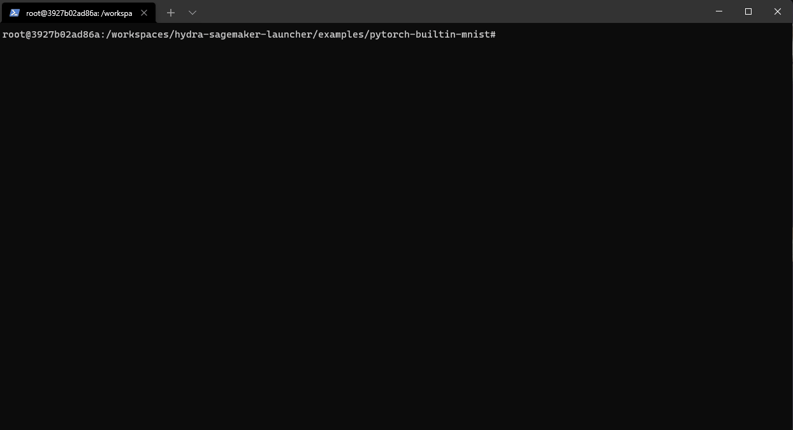

<p align="center"></p>

----------------------



----------------------

### Introduction

By default, Hydra runs your multi-run jobs locally and serially. Other launchers are available as plugins for launching in parallel and on different clusters. This plugin allows you to seamlessly run your training job on Amazon SageMaker without applying any code changes. It provides full support for built-in container images or by providing your own Dockerfile. All training artifacts will be synchronised back to your local machine, following the same directory structure as Hydra, allowing you to quickly experiment locally and scale to cloud resources.

### About Hydra

> *Hydra is an open-source Python framework that simplifies the development of research and other complex applications. The key feature is the ability to dynamically create a hierarchical configuration by composition and override it through config files and the command line. The name Hydra comes from its ability to run multiple similar jobs - much like a Hydra with multiple heads. ([source](https://hydra.cc/docs/intro))*

### Amazon SageMaker

> *Amazon SageMaker helps data scientists and developers to prepare, build, train, and deploy high-quality machine learning (ML) models quickly by bringing together a broad set of capabilities purpose-built for ML.*

### Releases

#### Development version (WIP)

**hydra-sagemaker-launcher 0.1** is the current development version.
- [Documentation](https://hydra.cc/docs/intro)
- Installation : `pip install hydra-sagemaker-launcher --upgrade`

### Usage

This plugin allows users to run machine learning experiments, which are using **Hydra** on **Amazon SageMaker** with little to no code changes.

You can simply run a local experiment on **Amazon SageMaker** by running:
```
python main.py hydra/launcher=sagemaker --multirun
```
Or executing multiple jobs in parallel:
```
python main.py hydra/launcher=sagemaker --multirun gamma=0.5,0.7,0.9
```

### Getting started
- Install the AWS CLI and make sure to be logged in
- The easiest way to get started is by using one of the provided examples

```bash
git clone https://github.com/dennisbappert/hydra-sagemaker-launcher
cd examples/pytorch-builtin-mnist

cp .env.template .env
vi .env # provide all required variables

# the sample uses the SageMaker PyTorch 1.8.1 container with Python 3.6
# the launcher internally uses pickle, for best compatibility use Python 3.6 locally
# (the same version as your desired container image)

pip install --no-cache-dir -r requirements.txt

# fire off the training job!
python main.py hydra/launcher=sagemaker --multirun
```


- **To be done**

### Features
- Rich support for SageMaker:
    - Builtin containers (PyTorch, Tensorflow)
    - Custom containers
    - CPU, GPU
    - Multi-node training
    - Managed spot training
    - ...
- Automatically create an archive of the local working directory and upload the files to S3 (only files which are not ignored by git)
- Little to no code changes required
- Automatically collect training artifacts and save them locally in the same way a local running training job would store artifacts.
- Flexible command execution to automate container image creation
- Fully compatible with Hydra (can be used with Sweepers)
- Fully compatible with SageMaker hyperparameters: you can override hyperparameters from the SageMaker Console.
- Full support for SageMaker local mode (requires **docker-compose**)
- .env file support to keep the configuration generic, not containing account specific information
- Support for Linux, Mac and Windows
- **In Progress:** Test coverage
- **Planned:** Support for multi-node training (needs further testing & _remote_invoke.py to be aware of the rank)
- **Planned:** Support for SageMaker HyperParameter Optimization
- **Planned:** Tensorflow example
- **Planned:** Automatic SageMaker Experiment tracking

### Sample configuration
```yaml
defaults:
  - aws_sagemaker

dry_run: False

s3_bucket: ${oc.env:HYDRA_SAGEMAKER_S3_BUCKET}
s3_bucket_prefix: hydra-sagemaker/pytorch-builtin-mnist/${now:%Y-%m-%d_%H-%M-%S}

script:
  script_dir: .

sagemaker:
  region: ${oc.env:HYDRA_SAGEMAKER_REGION}

  channels: {
      train: s3://my-dataset-location
  }

  estimator_options:
    role: ${oc.env:HYDRA_SAGEMAKER_ROLE_ARN}
    instance_count: 1
    instance_type: ml.g4dn.xlarge
    disable_profiler: True
    enable_sagemaker_metrics: True
    hyperparameters: ~

    framework_version: "1.8.1"
    py_version: py3

    metric_definitions:
      - Name: Train Epoch
        Regex: "Train Epoch: (\\d*)"
      - Name: Train loss
        Regex: "Train Epoch: .*Loss: (\\d*\\.?\\d+)"
      - Name: Test loss
        Regex: "Test set: Average loss: (\\d*\\.?\\d+),"
      - Name: Test accuracy
        Regex: "Test set: .* Accuracy: (\\d*)"

  fit_options:
    wait: False
    job_name: sm-hydra-mnist-${now:%Y-%m-%d-%H-%M-%S}s

```

### Examples
- **examples/pytorch-builtin-mnist**
    - PyTorch mnist example running with in a SageMaker builtin PyTorch container (converted from PyTorch examples repository)
    - Provides a **great starting point** for **rapid experimentation**

- **examples/pytorch-byoc-mnist**
    - PyTorch mnist example running in SageMaker with a custom container image, built locally and pushed to ECR as part of the command execution.

### Configuration reference
```yaml
defaults:
  - aws_sagemaker

# allows to not actually start the training but running through all steps of the pipeline
dry_run: False

# s3 location to store all artifacts produced during training: stdout, models, config files, code...
s3_bucket: ${oc.env:HYDRA_SAGEMAKER_S3_BUCKET}
# hydra supports a wide range of interpolations through OmegaConf
s3_bucket_prefix: hydra-sagemaker/pytorch-builtin-mnist/${now:%Y-%m-%d_%H-%M-%S}

# kwargs is a untyped scratchpad which allows storing of arbitrary variables
# and is very helpful for intermediate interpolation
kwargs:
  aws_account_id: ${env:HYDRA_SAGEMAKER_AWS_ACCOUNT_ID}
  container_name: sm_hydra_mnist
  repository: ${.aws_account_id}.dkr.ecr.${hydra.launcher.sagemaker.region}.amazonaws.com
  image_url: ${.repository}/${.container_name}:latest
  # "arn:aws:iam::${.aws_account_id}:role/service-role/AmazonSageMaker-ExecutionRole-**************"
  role_arn: ${env:HYDRA_SAGEMAKER_ROLE_ARN}
  dataset_s3_location: ${env:HYDRA_SAGEMAKER_DATASET_S3_BUCKET}

script:
  # the path to the code
  # IMPORTANT: the plugin uses git to determine files which are ignored (e.g. data directories, logs, etc.)
  # the repository has to be a git repository and all necessary files should not be ignored using a .gitignore
  script_dir: .

# commands_up provides a simple command execution pipeline for preprocessing steps
# required to run the training job
# the following section provides a very simple example building a local docker image and push it to ECR
# WARNING: credentials will be stored unencrypted by using docker login!
commands_up:
  - name: "Building container image"
    cmd:
      [
        "docker build -t ${hydra.launcher.kwargs.container_name} -f ./Dockerfile .",
      ]
    shell: True

  - name: "Login to target ECR repository"
    cmd:
      [
        "aws ecr get-login-password --region ${hydra.launcher.sagemaker.region} | docker login --username AWS --password-stdin ${hydra.launcher.kwargs.repository}",
      ]
    shell: True

  - name: "Create target repository (this will silently fail if it already exists)"
    cmd:
      [
        "aws ecr create-repository --repository-name ${hydra.launcher.kwargs.container_name} || true",
      ]
    shell: True

  - name: "Push container image to ECR"
    cmd:
      [
        "docker tag ${hydra.launcher.kwargs.container_name} ${hydra.launcher.kwargs.image_url} && docker push ${hydra.launcher.kwargs.image_url}",
      ]
    shell: True

# as part of the pipeline you can sync files to S3, e.g. artifacts or a local dataset
# to make them available to your training job
# (uses aws s3 sync)
sync_up:
  - name: "Sync dataset to S3"
    target_dir: ${hydra.launcher.kwargs.dataset_s3_location}
    source_dir: "./data"
    include: ["*"]
    exclude: ~

sagemaker:
  # the target region to start the training job
  # IMPORTANT: the s3 bucket has to be in the same region
  region: ${oc.env:HYDRA_SAGEMAKER_REGION}

  # additional channels passed to the training job
  # (reference: https://docs.aws.amazon.com/sagemaker/latest/APIReference/API_Channel.html)
  channels:
      train: s3://my-dataset-location

  # all parameters are directly passed to the underlying SageMaker SDK
  # (reference: https://sagemaker.readthedocs.io/en/stable/api/training/estimators.html)
  estimator_options:
    role: ${hydra.launcher.kwargs.role_arn}
    instance_count: 1
    instance_type: ml.g4dn.xlarge
    # instance_type: local
    disable_profiler: True
    hyperparameters:
      model.output_size: 10

    # you can either specify your own image_uri to use a custom container
    image_uri: ${hydra.launcher.kwargs.image_url}
    # or use builtin containers provided by SageMaker
    # framework_version: '1.8.1'
    # py_version: py3

  # all parameters are directly passed to the underlying SageMaker SDK
  # (reference: https://sagemaker.readthedocs.io/en/stable/api/training/estimators.html#sagemaker.estimator.Estimator.fit)
  fit_options:
    wait: False
    job_name: sm-hydra-mnist-${now:%Y-%m-%d-%H-%M-%S}s

```